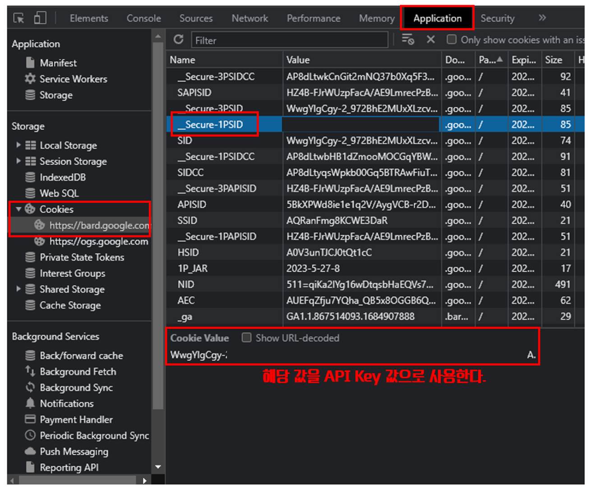

# Google의 Bard를 API처럼 사용하기.

## Google에서 공개한 Bard   
<br>
Bard는 Google AI에서 공개한 챗봇이다. 

우선 Bard가 무엇인지 Bard 자체에 물어보면

- Bard는 Google AI에서 만든 대규모 언어 모델
- 방대한 양의 텍스트와 코드 데이터 세트로 훈련
- 질문에 대한 응답으로 의사 소통하고 사람과 같은 텍스트를 생성

위에 정리된 내용처럼 Chat GPT 처럼 생성형 언어 모델인 것을 볼 수 있다.

현재 Chat GPT는 유료이기는 하지만, API를 사용하여 사용할 수 있는데 Bard는 아직 공식적인 API는 지원되지 않았지만 비공식적으로 Bard를 API처럼 사용할 수 있다.

• https://github.com/dsdanielpark/Bard-API

 

---

Collab에서 Bard를 API처럼 사용해보자.
<br>
<br>
## Bard API 패키지 설치
<br>
```python
!pip install bardapi
```

우선 Bard api 관련 패키지를 설치해야한다.

설치를 완료한 뒤에는 2가지 기능을 추가해준다 .

```python
import bardapi
import os
```

다른 방법으로는 아래처럼 사용할 수도 있다.

```python
from bardapi import Bard
import os
```

## Bard API Key
<br>
Bard의 API는 공식적인 것이 아니므로 API Key 역할을 하는 부분을 찾아야한다. 

우선, Bard에 접속하고 F12를 눌러 개발자 모드를 이용해 찾을 수 있다.

찾아야 할 값은 *Secur-1PSID 이다.*



<br>
<br>

```python
# api key
os.environ["_BARD_API_KEY"] = "본인의 API 키를 넣을것"
```

해당 부분에 Key 값을 넣어준다.

## 질문과 응답 받기
<br>
질문은 사전 입력 값으로 사용해도 좋고 아니면 input 함수를 사용하여 입력을 받는 방법, 두가지 모두 좋은 것 같다.

```python
# 사전에 값을 설정하기
input_text = "구글의 바드에 대해서 소개해줄래 ?"

# 사용간에 입력 받기
input_text = input("질문 텍스트 입력 : ")
```

이제 Bard에 질문을 전달한다.

```python
def use_bard( input_text ) :
	response = bardapi.core.Bard().get_answer( input_text )
	
	return response
```

import 할 때 두번째 방식으로 추가했다면 아래처럼 쓸 수 있다.

```python
from bardapi import Bard

def use_bard( input_text ) :
	response = Bard().get_answer( input_text )
	
	return response
```

## Bard에서 돌아오는 값
<br>
Bard의 응답은 다음 코드로 확인할 수 있다.

```python
use_bard()["content"]
```
<br>
## Bard가 반환하는 여러 개의 값 
<br>
Chat GPT API의 경우 하나의 답변이 돌아오지만 Bard의 경우 여러개의 답변이 돌아온다. 


실제 Bard를 이용해보면 화면에 나오는 답변 이외에 좌측 상단에서 다른 답변을 확인할 수도 있는데 다른 답변들도 같이 반환시에 포함시켜 주는 것 같다.

따라서 필요한 답변을 선택해야 하는데,

```python
response["choices"][0]["content"]
response["choices"][1]["content"]
```

위의 형식처럼 “choice”의 값에 index를 통해 접근할 수 있다. 

## 추가적인 설정 사항
<br>

현재 Bard API는 공식적인 지원이 아니다보니 API 방식으로 요청과 응답을 진행하다보면 봇으로 판단되는 경우가 종종 발생하는 것 같다 .

이에 대한 차선책으로 요청을 보내는 주체가 사람이라는 값을 같이 포함하여 보내주는 방식으로 우회해 볼 수 있다. 

```python
import requests

session = requests.Session()

session.headers = {
    "Host" : "bard.google.com",
    "X-SameDomain" : "1", 
    "User-Agent" : "Mozilla/5.0 (Windows NT 10.0; Win64; x64) AppleWebKit/537.36 (KHTML, like Gecko) Chrome/113.0.0.0 Safari/537.36",
    "Content-Type" : "application/x-www-form-urlencoded:charset=UTF-8",
    "Origin" : "https://bard.google.com", 
    "Referer" : "https://bard.google.com/",
    }

session.cookies.set("__Secure-1PSID", os.environ["_BARD_API_KEY"])

bard = Bard(session=session)

response = bard.get_answer("한국에 대해 알려줄래?")["content"]
```
---

[User Agent 정보 얻기](https://www.useragentstring.com/)