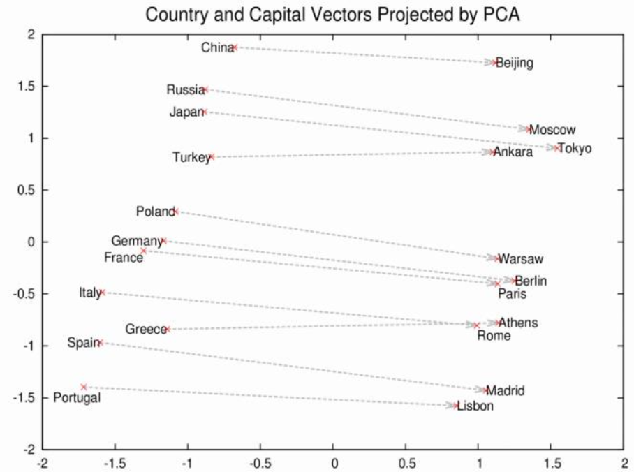
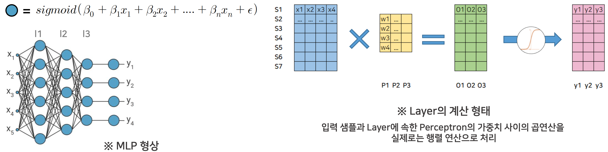

<h1>AI Factory - 자연어 처리 입문</h1>
<strong>자연어 처리란?</strong> 
: 인간의 언어 텍스트를 컴퓨터로 표현 
: 뜻, 문법과 같은 질적 특성을 표현, 처리할 수 있게 하는 것   

<strong>자연어처리의 핵심</strong> 
: 텍스트를 개념, 의미를 나타낼 수 있는 수로 바꾸어 나타내는 과정   

<strong>어떻게 의미를 처리할까?</strong> 
1. 형태소 분리(Tokenizing): 문장을 형태소 단위로 분리
- 한국어는 왜 처리가 까다로울까?  
    * Father enters the room. 
    -> 띄어쓰기를 기준으로 웬만하면 구분 가능 
    * 아버지가 방에 들어가신다.  
    -> 어미들이 붙어있고, 어미에 따라서 의미가 달라지기 때문에 처리가 까다롭다.  
- Tokenizer: 형태소 분리를 해주는 Algorithm 
    * 지도학습 
        * KoNLPy에서 Okt, Komoran, Mecab(은전한닢), Hannanum, Kkma(꼬꼬마)를 지원
        * 전문가들이 단어들의 품사를 분리 해놓은 corpus(말뭉치)를 가지고 학습 진행 
        (이미 존재하는 사전을 기반으로 분리)
        * 알고리즘별로 품사 tagging도 지원
        * 단점 
        : '에이블스쿨'이라는 단어는 corpus에 존재하지 않기 때문에 '에 이 불 스쿨' 이렇게 5개로 형태소를 분리하게 된다. 따라서 이런 고유명사들은 따로 사전에 추가하는 방식을 사용해야 한다.
    * 비지도학습
        * 사용자가 직접 말뭉치를 제공하고 알아서 학습을 통한 형태소 분리 진행
        * 단점 
        : 시간이 꽤 소요
  

2. 임베딩(Embedding) 
: 컴퓨터가 자연어 자체를 해석할 수 없기 때문에 수로 표현해주는 과정 
    * One-Hot Encoding 
     
    

    * TF-IDF 
    : 문서별 형태소 중요도 계산  
    : 모든 문서에 자주 나오는 형태소는 중요도가 낮고, 특정 문서들에만 집중되는 형태소는 중요도가 높다는 가정 
      
        * TF matrix: 빈도수 
         
            

        * TF-IDF matrix 
         
        : TF matrix와 공식을 통해 계산된 matrix 
    
        -> 단점 
        : 너무 sparse하다. 
        (0이 너무 많아, 크기와 연산량 부분에서 낭비) 

    * 단어 수준, 문장 수준 임베딩 
        * 단어 수준: Word2Vec, Glove, FastText 등
        * 문장 수준: BERT, GPT 등
    
    * Word2Vec 
     
    나라와 도시에 해당하는 단어만 가져와서 임베딩 시킨 벡터를 PCA를 통해 2차원 축소를 하여 시각화 한 결과, 나라-수도로 묶인 것을 볼 수 있음 

         
    사랑, 이별에 대한 임베딩 된 벡터를 더한 다음 해당 벡터와 가장 가까운 값을 가지는 벡터에 해당하는 단어를 확인했을 때, 추억이 나온 것을 확인할 수 있음 
    즉, 자연어 간의 연산이 가능하게끔 만들어 줌  
        * CBOW 
        : 주변단어 -> 중심단어 예측

        * Skip-Gram 
        : 중심단어 -> 주변단어 예측 
          
        
        <strong>N-Gram이란?</strong> 
        : 문장 내의 형태소들을 n개의 단위로 묶은 것 
        : 형태소들 간의 순서와 인접성을 알 수 있음 
        : 조건부 확률 계산 가능 
         (특정 형태소 리스트가 주어졌을 때 특정 단어가 나올 확률을 각각 계산하여 앞 또는 뒤에 어떤 단어가 위치하는 것이 좋을지 예측할 수 있다.) 
        : 이를 활용한 서비스가 스마트 키보드, 검색어 자동완성 기능  

    * 퍼셉트론 
        * 목표변수 y에 영향을 준다고 판단되는 x 벡터와 오차가 있다고 가정 
        * 각각의 x가 y에 영향을 어느정도 주는지에 대한 정보를 담은 가중치 beta가 있다고 가정 
        * 이 정보들을 가지고 예측한 y를 sigmoid 함수를 통해 0~1 사이의 값으로 변환 
          
    * 이러한 방식을 이용해서 학습하는 인공신경망 모델을 Skip-Gram 
      

